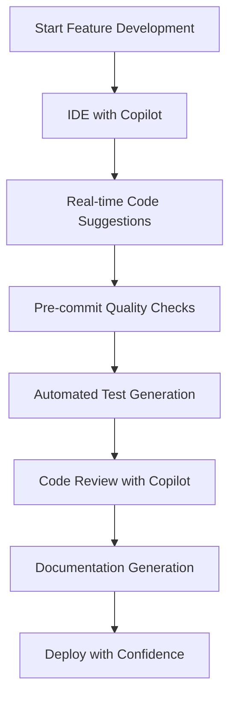
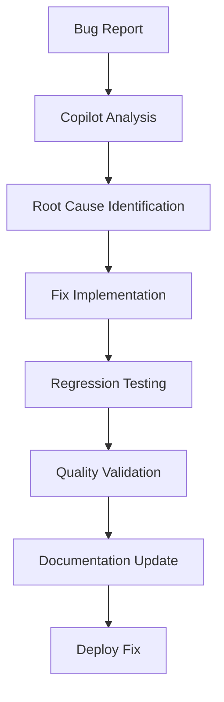
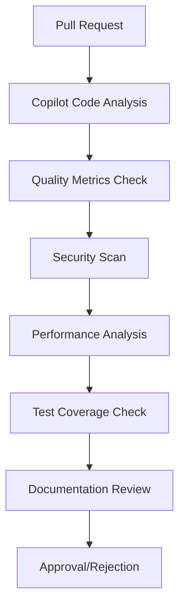

# GitHub Copilot Integration Design

**Version:** 1.0.0  
**Last Updated:** January 27, 2025  
**Status:** Ready for Implementation  
**Purpose**: Design comprehensive GitHub Copilot integration for code quality and regression prevention

---

## 🎯 Integration Goals

### Primary Objectives

1. **Code Quality Enhancement**: Leverage Copilot for automated code improvements
2. **Regression Prevention**: Use Copilot to identify and prevent code regressions
3. **Development Workflow Integration**: Seamlessly integrate Copilot into existing workflows
4. **Automated Documentation**: Generate and maintain documentation using Copilot
5. **Test Generation**: Automate test creation and maintenance

### Success Metrics

- **Code Quality Improvement**: > 20% reduction in linting errors
- **Test Coverage**: > 90% for new features
- **Documentation Coverage**: > 95% for public APIs
- **Regression Rate**: < 2% of changes
- **Development Speed**: > 15% faster feature development

---

## 🏗️ Integration Architecture

### High-Level Architecture

```
┌─────────────────────────────────────────────────────────────┐
│                    Development Workflow                     │
│  [IDE] → [Pre-commit] → [CI/CD] → [Code Review] → [Deploy] │
└─────────────────────┬───────────────────────────────────────┘
                      │
                      ▼
┌─────────────────────────────────────────────────────────────┐
│                Copilot Integration Layer                    │
│  [Code Analysis] → [Quality Checks] → [Test Generation]    │
│  [Doc Generation] → [Regression Detection] → [Optimization] │
└─────────────────────┬───────────────────────────────────────┘
                      │
                      ▼
┌─────────────────────────────────────────────────────────────┐
│                   Claude Agent System                       │
│  [Task Assignment] → [Quality Validation] → [Approval]     │
└─────────────────────────────────────────────────────────────┘
```

### Integration Components

```typescript
interface CopilotIntegration {
  codeAnalysis: CodeAnalysisService;
  qualityChecks: QualityCheckService;
  testGeneration: TestGenerationService;
  documentation: DocumentationService;
  regressionDetection: RegressionDetectionService;
  optimization: OptimizationService;
}
```

---

## 🔧 Integration Layers

### Layer 1: Development Workflow Integration

#### Pre-commit Hooks

```bash
#!/bin/bash
# .git/hooks/pre-commit

# Run Copilot code analysis
echo "Running Copilot code analysis..."
copilot-analyze --staged --format=json > copilot-analysis.json

# Check for quality issues
if ! copilot-quality-check --analysis=copilot-analysis.json --threshold=0.8; then
  echo "Code quality issues detected. Please review and fix."
  exit 1
fi

# Generate test suggestions
copilot-test-suggest --staged --output=test-suggestions.md

# Check for potential regressions
if ! copilot-regression-check --staged --baseline=main; then
  echo "Potential regressions detected. Please review."
  exit 1
fi

echo "Copilot checks passed. Proceeding with commit."
```

#### IDE Integration

```typescript
// VS Code extension configuration
interface CopilotIDEConfig {
  enabled: boolean;
  features: {
    codeCompletion: boolean;
    codeReview: boolean;
    testGeneration: boolean;
    documentation: boolean;
    refactoring: boolean;
  };
  qualityThresholds: {
    complexity: number;
    maintainability: number;
    security: number;
    performance: number;
  };
  autoSuggestions: {
    enabled: boolean;
    confidence: number; // 0.0 - 1.0
    categories: string[];
  };
}
```

#### Real-time Code Assistance

```typescript
class CopilotCodeAssistant {
  async analyzeCode(code: string, context: CodeContext): Promise<CodeAnalysis> {
    const analysis = await this.copilotAPI.analyze({
      code,
      context: {
        fileType: context.fileType,
        projectType: context.projectType,
        dependencies: context.dependencies,
        recentChanges: context.recentChanges,
      },
    });

    return {
      suggestions: analysis.suggestions,
      qualityIssues: analysis.qualityIssues,
      securityConcerns: analysis.securityConcerns,
      performanceOptimizations: analysis.performanceOptimizations,
      testSuggestions: analysis.testSuggestions,
    };
  }

  async generateTests(code: string, testType: TestType): Promise<TestSuite> {
    const testSuite = await this.copilotAPI.generateTests({
      code,
      testType,
      framework: this.getTestFramework(),
      coverage: this.getCoverageRequirements(),
    });

    return {
      unitTests: testSuite.unitTests,
      integrationTests: testSuite.integrationTests,
      e2eTests: testSuite.e2eTests,
      testData: testSuite.testData,
      mocks: testSuite.mocks,
    };
  }

  async generateDocumentation(
    code: string,
    docType: DocType,
  ): Promise<Documentation> {
    const documentation = await this.copilotAPI.generateDocs({
      code,
      docType,
      format: "markdown",
      includeExamples: true,
      includeAPIDocs: true,
    });

    return {
      functionDocs: documentation.functionDocs,
      classDocs: documentation.classDocs,
      apiDocs: documentation.apiDocs,
      examples: documentation.examples,
      diagrams: documentation.diagrams,
    };
  }
}
```

### Layer 2: Quality Assurance Automation

#### Automated Code Review

```typescript
class CopilotCodeReviewer {
  async reviewCode(pr: PullRequest): Promise<CodeReview> {
    const changes = await this.getPRChanges(pr);
    const review: CodeReview = {
      prId: pr.id,
      overallScore: 0,
      issues: [],
      suggestions: [],
      securityConcerns: [],
      performanceIssues: [],
      testRecommendations: [],
    };

    for (const change of changes) {
      const analysis = await this.analyzeChange(change);
      review.issues.push(...analysis.issues);
      review.suggestions.push(...analysis.suggestions);
      review.securityConcerns.push(...analysis.securityConcerns);
      review.performanceIssues.push(...analysis.performanceIssues);
      review.testRecommendations.push(...analysis.testRecommendations);
    }

    review.overallScore = this.calculateOverallScore(review);
    return review;
  }

  private async analyzeChange(change: CodeChange): Promise<ChangeAnalysis> {
    const analysis = await this.copilotAPI.analyzeChange({
      oldCode: change.oldCode,
      newCode: change.newCode,
      fileType: change.fileType,
      context: change.context,
    });

    return {
      issues: analysis.qualityIssues.map((issue) => ({
        type: issue.type,
        severity: issue.severity,
        message: issue.message,
        suggestion: issue.suggestion,
        line: issue.line,
        column: issue.column,
      })),
      suggestions: analysis.improvements.map((improvement) => ({
        type: improvement.type,
        description: improvement.description,
        code: improvement.code,
        confidence: improvement.confidence,
      })),
      securityConcerns: analysis.securityIssues,
      performanceIssues: analysis.performanceIssues,
      testRecommendations: analysis.testSuggestions,
    };
  }
}
```

#### Quality Metrics Tracking

```typescript
interface QualityMetrics {
  codeComplexity: {
    cyclomaticComplexity: number;
    cognitiveComplexity: number;
    maintainabilityIndex: number;
  };
  testCoverage: {
    lineCoverage: number;
    branchCoverage: number;
    functionCoverage: number;
    statementCoverage: number;
  };
  documentationCoverage: {
    functionDocumentation: number;
    classDocumentation: number;
    apiDocumentation: number;
    inlineComments: number;
  };
  securityScore: {
    vulnerabilityCount: number;
    securityIssues: number;
    dependencyIssues: number;
    overallScore: number;
  };
  performanceScore: {
    bundleSize: number;
    loadTime: number;
    memoryUsage: number;
    cpuUsage: number;
  };
}

class QualityMetricsTracker {
  async trackMetrics(project: Project): Promise<QualityMetrics> {
    const metrics: QualityMetrics = {
      codeComplexity: await this.analyzeComplexity(project),
      testCoverage: await this.analyzeTestCoverage(project),
      documentationCoverage: await this.analyzeDocumentation(project),
      securityScore: await this.analyzeSecurity(project),
      performanceScore: await this.analyzePerformance(project),
    };

    await this.storeMetrics(project.id, metrics);
    return metrics;
  }

  async generateQualityReport(project: Project): Promise<QualityReport> {
    const metrics = await this.getLatestMetrics(project.id);
    const trends = await this.getMetricTrends(project.id);

    return {
      project: project.name,
      timestamp: new Date(),
      metrics,
      trends,
      recommendations: this.generateRecommendations(metrics, trends),
      actionItems: this.generateActionItems(metrics),
    };
  }
}
```

### Layer 3: Regression Prevention System

#### Change Impact Analysis

```typescript
class RegressionPreventionSystem {
  async analyzeChangeImpact(change: CodeChange): Promise<ChangeImpact> {
    const impact: ChangeImpact = {
      changeId: change.id,
      riskLevel: "low",
      affectedComponents: [],
      potentialRegressions: [],
      testRecommendations: [],
      rollbackPlan: null,
    };

    // Analyze code dependencies
    const dependencies = await this.analyzeDependencies(change);
    impact.affectedComponents = dependencies.affectedComponents;

    // Check for breaking changes
    const breakingChanges = await this.detectBreakingChanges(change);
    impact.potentialRegressions = breakingChanges;

    // Assess risk level
    impact.riskLevel = this.assessRiskLevel(impact);

    // Generate test recommendations
    impact.testRecommendations = await this.generateTestRecommendations(
      change,
      impact,
    );

    // Create rollback plan if high risk
    if (impact.riskLevel === "high") {
      impact.rollbackPlan = await this.createRollbackPlan(change);
    }

    return impact;
  }

  async detectBreakingChanges(change: CodeChange): Promise<BreakingChange[]> {
    const breakingChanges: BreakingChange[] = [];

    // API signature changes
    const apiChanges = await this.detectAPIChanges(change);
    breakingChanges.push(...apiChanges);

    // Database schema changes
    const schemaChanges = await this.detectSchemaChanges(change);
    breakingChanges.push(...schemaChanges);

    // Configuration changes
    const configChanges = await this.detectConfigChanges(change);
    breakingChanges.push(...configChanges);

    // Dependency changes
    const depChanges = await this.detectDependencyChanges(change);
    breakingChanges.push(...depChanges);

    return breakingChanges;
  }

  async generateTestRecommendations(
    change: CodeChange,
    impact: ChangeImpact,
  ): Promise<TestRecommendation[]> {
    const recommendations: TestRecommendation[] = [];

    // Unit test recommendations
    const unitTests = await this.copilotAPI.generateUnitTests({
      code: change.newCode,
      focus: "regression-prevention",
      coverage: "comprehensive",
    });
    recommendations.push({
      type: "unit",
      description: "Comprehensive unit tests for changed functions",
      tests: unitTests,
      priority: "high",
    });

    // Integration test recommendations
    if (impact.affectedComponents.length > 1) {
      const integrationTests = await this.copilotAPI.generateIntegrationTests({
        components: impact.affectedComponents,
        change: change,
      });
      recommendations.push({
        type: "integration",
        description: "Integration tests for affected components",
        tests: integrationTests,
        priority: "medium",
      });
    }

    // E2E test recommendations
    if (impact.riskLevel === "high") {
      const e2eTests = await this.copilotAPI.generateE2ETests({
        change: change,
        userFlows: this.getAffectedUserFlows(impact),
      });
      recommendations.push({
        type: "e2e",
        description: "End-to-end tests for critical user flows",
        tests: e2eTests,
        priority: "high",
      });
    }

    return recommendations;
  }
}
```

#### Automated Test Generation

```typescript
class CopilotTestGenerator {
  async generateTestSuite(
    code: string,
    requirements: TestRequirements,
  ): Promise<TestSuite> {
    const testSuite: TestSuite = {
      unitTests: [],
      integrationTests: [],
      e2eTests: [],
      testData: [],
      mocks: [],
    };

    // Generate unit tests
    if (requirements.unitTests) {
      testSuite.unitTests = await this.generateUnitTests(code, requirements);
    }

    // Generate integration tests
    if (requirements.integrationTests) {
      testSuite.integrationTests = await this.generateIntegrationTests(
        code,
        requirements,
      );
    }

    // Generate E2E tests
    if (requirements.e2eTests) {
      testSuite.e2eTests = await this.generateE2ETests(code, requirements);
    }

    // Generate test data
    testSuite.testData = await this.generateTestData(code, requirements);

    // Generate mocks
    testSuite.mocks = await this.generateMocks(code, requirements);

    return testSuite;
  }

  private async generateUnitTests(
    code: string,
    requirements: TestRequirements,
  ): Promise<UnitTest[]> {
    const tests = await this.copilotAPI.generateUnitTests({
      code,
      framework: requirements.framework || "jest",
      coverage: requirements.coverage || "comprehensive",
      patterns: requirements.patterns || [
        "happy-path",
        "edge-cases",
        "error-handling",
      ],
    });

    return tests.map((test) => ({
      name: test.name,
      description: test.description,
      code: test.code,
      assertions: test.assertions,
      coverage: test.coverage,
    }));
  }

  private async generateIntegrationTests(
    code: string,
    requirements: TestRequirements,
  ): Promise<IntegrationTest[]> {
    const tests = await this.copilotAPI.generateIntegrationTests({
      code,
      framework: requirements.framework || "jest",
      components: requirements.components || [],
      scenarios: requirements.scenarios || [
        "api-integration",
        "database-integration",
      ],
    });

    return tests.map((test) => ({
      name: test.name,
      description: test.description,
      code: test.code,
      setup: test.setup,
      teardown: test.teardown,
      assertions: test.assertions,
    }));
  }
}
```

### Layer 4: Documentation Automation

#### Automated Documentation Generation

```typescript
class CopilotDocumentationGenerator {
  async generateDocumentation(
    code: string,
    docType: DocType,
  ): Promise<Documentation> {
    const documentation: Documentation = {
      apiDocs: [],
      functionDocs: [],
      classDocs: [],
      examples: [],
      diagrams: [],
    };

    // Generate API documentation
    if (docType.includes("api")) {
      documentation.apiDocs = await this.generateAPIDocs(code);
    }

    // Generate function documentation
    if (docType.includes("functions")) {
      documentation.functionDocs = await this.generateFunctionDocs(code);
    }

    // Generate class documentation
    if (docType.includes("classes")) {
      documentation.classDocs = await this.generateClassDocs(code);
    }

    // Generate examples
    if (docType.includes("examples")) {
      documentation.examples = await this.generateExamples(code);
    }

    // Generate diagrams
    if (docType.includes("diagrams")) {
      documentation.diagrams = await this.generateDiagrams(code);
    }

    return documentation;
  }

  private async generateAPIDocs(code: string): Promise<APIDoc[]> {
    const apiDocs = await this.copilotAPI.generateAPIDocs({
      code,
      format: "openapi",
      includeExamples: true,
      includeSchemas: true,
    });

    return apiDocs.map((doc) => ({
      endpoint: doc.endpoint,
      method: doc.method,
      description: doc.description,
      parameters: doc.parameters,
      responses: doc.responses,
      examples: doc.examples,
      schema: doc.schema,
    }));
  }

  private async generateFunctionDocs(code: string): Promise<FunctionDoc[]> {
    const functionDocs = await this.copilotAPI.generateFunctionDocs({
      code,
      format: "jsdoc",
      includeExamples: true,
      includeTypes: true,
    });

    return functionDocs.map((doc) => ({
      name: doc.name,
      description: doc.description,
      parameters: doc.parameters,
      returnType: doc.returnType,
      examples: doc.examples,
      jsdoc: doc.jsdoc,
    }));
  }
}
```

---

## 🔄 Integration Workflows

### Workflow 1: Feature Development



### Workflow 2: Bug Fix Process



### Workflow 3: Code Review Process



---

## 📊 Monitoring and Analytics

### Integration Metrics

```typescript
interface CopilotIntegrationMetrics {
  codeQuality: {
    lintingErrors: number;
    complexityScore: number;
    maintainabilityIndex: number;
    securityIssues: number;
  };
  testCoverage: {
    lineCoverage: number;
    branchCoverage: number;
    functionCoverage: number;
    statementCoverage: number;
  };
  documentation: {
    apiDocumentation: number;
    functionDocumentation: number;
    classDocumentation: number;
    inlineComments: number;
  };
  performance: {
    buildTime: number;
    testExecutionTime: number;
    bundleSize: number;
    loadTime: number;
  };
  regressionPrevention: {
    regressionsDetected: number;
    regressionsPrevented: number;
    falsePositives: number;
    accuracy: number;
  };
}
```

### Dashboard Integration

```typescript
class CopilotDashboard {
  async getMetrics(
    projectId: string,
    timeRange: TimeRange,
  ): Promise<DashboardMetrics> {
    const metrics = await this.metricsService.getMetrics(projectId, timeRange);

    return {
      overview: {
        codeQuality: metrics.codeQuality.overall,
        testCoverage: metrics.testCoverage.overall,
        documentation: metrics.documentation.overall,
        performance: metrics.performance.overall,
      },
      trends: {
        codeQuality: this.calculateTrend(metrics.codeQuality.history),
        testCoverage: this.calculateTrend(metrics.testCoverage.history),
        documentation: this.calculateTrend(metrics.documentation.history),
        performance: this.calculateTrend(metrics.performance.history),
      },
      recommendations: await this.generateRecommendations(metrics),
      alerts: await this.getAlerts(metrics),
    };
  }
}
```

---

## 🚀 Implementation Plan

### Phase 1: Foundation Setup (Week 1-2)

- [ ] Set up Copilot API integration
- [ ] Implement pre-commit hooks
- [ ] Create code analysis service
- [ ] Set up quality metrics tracking

### Phase 2: Quality Assurance (Week 3-4)

- [ ] Implement automated code review
- [ ] Set up regression detection
- [ ] Create test generation service
- [ ] Implement quality gates

### Phase 3: Documentation & Testing (Week 5-6)

- [ ] Set up documentation generation
- [ ] Implement automated test generation
- [ ] Create test coverage tracking
- [ ] Set up performance monitoring

### Phase 4: Advanced Features (Week 7-8)

- [ ] Implement change impact analysis
- [ ] Set up automated refactoring
- [ ] Create learning mechanisms
- [ ] Implement predictive analytics

### Phase 5: Integration & Optimization (Week 9-10)

- [ ] Integrate with Claude agent system
- [ ] Optimize performance
- [ ] Set up monitoring and alerting
- [ ] Validate effectiveness

---

## 🔒 Security and Privacy

### Data Protection

- **Code Analysis**: All code analysis is done locally or through secure APIs
- **Data Retention**: Code data is not stored permanently
- **Access Control**: Strict access controls for Copilot integration
- **Audit Logging**: All Copilot interactions are logged for audit

### Privacy Considerations

- **Code Privacy**: Code is not shared with external parties
- **User Consent**: Clear consent for code analysis
- **Data Minimization**: Only necessary data is processed
- **Transparency**: Clear documentation of data usage

---

## 📚 Related Documentation

- [Evolution Plan](./EVOLUTION_PLAN.md) - Master evolution strategy
- [Dev-Bots Agents Plan](./DEV_BOTS_AGENTS_PLAN.md) - Agent strategy
- [Claude Agent Experiments](./CLAUDE_AGENT_EXPERIMENTS.md) - Experimentation framework
- [Architecture V2](../ARCHITECTURE_V2.md) - System architecture

---

**Next Steps**:

1. Set up Copilot API integration
2. Implement pre-commit hooks
3. Create code analysis service
4. Begin quality assurance automation

**Last Updated**: January 27, 2025  
**Next Review**: February 3, 2025  
**Status**: Ready for Implementation
